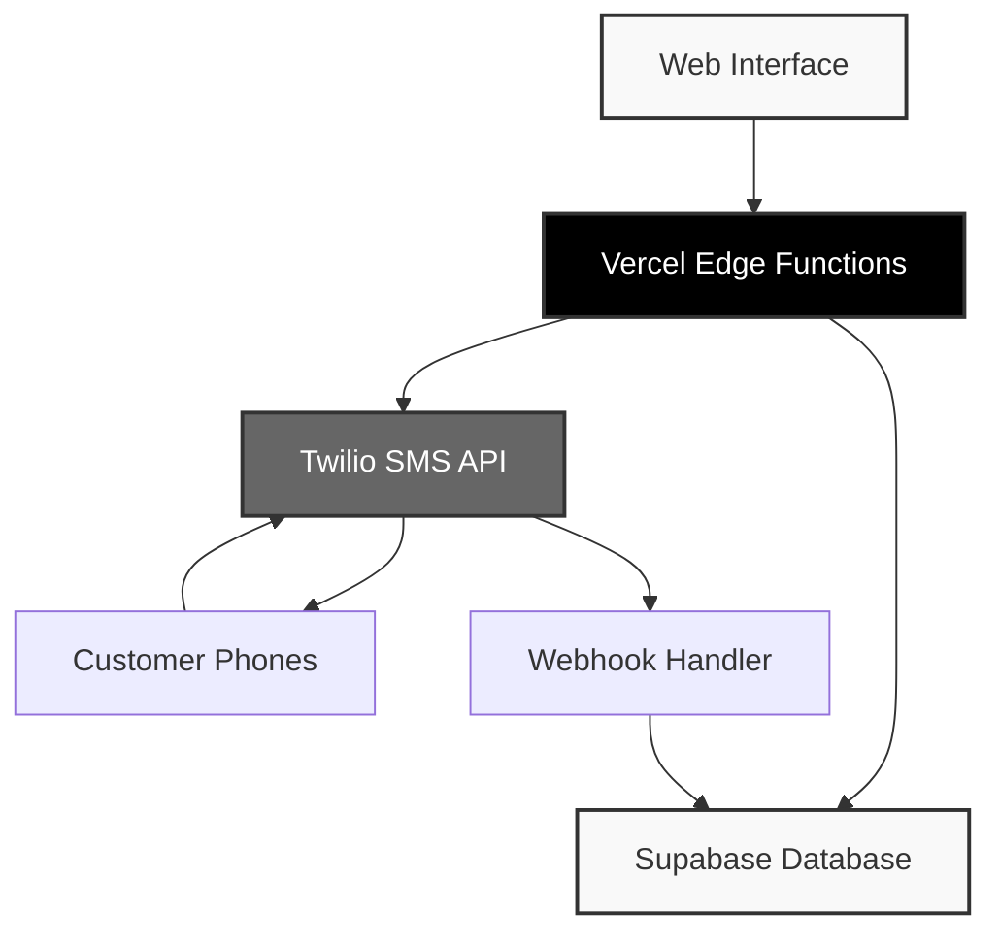
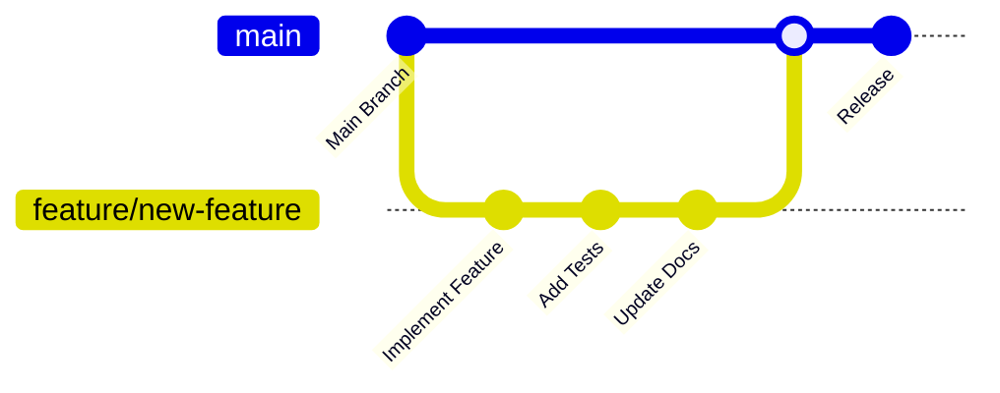

<div align="center">

# Cuchen SMS Management System

### Enterprise-Grade SMS Communication Platform

*Professional two-way SMS communication system designed for customer service excellence*

---


</div>

---

## Core Capabilities

<table>
<tr>
<td width="50%" valign="top">

### **Message Management**
```
✓ 21 Professional Templates
  • 11 English Templates
  • 10 Korean Templates (한국어)
  • Custom Message Creation
  • Dynamic Variable Support

✓ Advanced Message Features
  • Real-time Preview
  • Character/Segment Counter
  • Multi-language Support
  • Template Categorization
```

### **Communication Channels**
```
✓ Outbound Messaging
  • Template-based Sending
  • Bulk Message Support
  • Delivery Confirmation
  • Cost Tracking

✓ Inbound Message Handling
  • Real-time Reception
  • Conversation Threading
  • Quick Reply System
  • Message Status Tracking
```

</td>
<td width="50%" valign="top">

### **Data & Analytics**
```
✓ Message Export System
  • CSV Format (Excel Compatible)
  • TXT Format (Human Readable)
  • JSON Format (API Compatible)
  • UTF-8 Korean Character Support

✓ Advanced Filtering
  • Date Range Selection
  • Custom Time Periods
  • Message Type Filtering
  • Conversation Search
```

### **Security & Compliance**
```
✓ Enterprise Security
  • Password Protection
  • Rate Limiting Controls
  • IP-based Restrictions
  • Content Filtering

✓ Audit & Monitoring
  • Complete Message Logging
  • Delivery Status Tracking
  • Usage Analytics
  • Error Reporting
```

</td>
</tr>
</table>

---

## System Architecture

<div align="center">



</div>

## Prerequisites

<div align="center">

| Service | Requirement | Cost | Purpose |
|---------|-------------|------|---------|
|  | [Account Setup](https://www.twilio.com/try-twilio) | Free Trial Available | SMS Gateway |
|  | [Database Account](https://supabase.com) | Free Tier Available | Message Storage |
|  | [Hosting Account](https://vercel.com/signup) | Free Tier Available | Application Hosting |
|  | [Repository Access](https://github.com/signup) | Free | Code Management |
|  | [Local Installation](https://nodejs.org/) | Free | Development Environment |

</div>

## 🛠️ Quick Setup

### Step 1: Fork/Clone this Repository

1. Click "Use this template" or fork this repository
2. Clone to your local machine:
```bash
git clone https://github.com/YOUR_USERNAME/sms-app.git
cd sms-app
```

### Step 2: Set Up Supabase Database

1. Sign up for [Supabase](https://supabase.com)
2. Create a new project
3. Go to SQL Editor and run this query to create the messages table:

```sql
CREATE TABLE incoming_messages (
  id BIGSERIAL PRIMARY KEY,
  from_number TEXT NOT NULL,
  to_number TEXT NOT NULL,
  message TEXT NOT NULL,
  message_sid TEXT UNIQUE,
  timestamp TIMESTAMPTZ DEFAULT NOW(),
  read BOOLEAN DEFAULT FALSE
);

-- Add index for better performance
CREATE INDEX idx_incoming_messages_from_number ON incoming_messages(from_number);
CREATE INDEX idx_incoming_messages_timestamp ON incoming_messages(timestamp DESC);
```

4. Get your credentials from Settings → API:
   - Project URL
   - Service Role Key (not anon key!)

### Step 3: Configure Twilio

1. Sign up for [Twilio](https://www.twilio.com/try-twilio)
2. Get your credentials from [Twilio Console](https://console.twilio.com):
   - Account SID
   - Auth Token
   - Phone Number
3. **Important**: You'll configure the webhook URL after deployment

### Step 4: Deploy to Vercel

#### Option A: Deploy with Vercel Button (Easiest)

[](https://vercel.com/new/clone?repository-url=https://github.com/YOUR_USERNAME/sms-app)

#### Option B: Deploy via CLI

1. Install Vercel CLI:
```bash
npm install -g vercel
```

2. Deploy:
```bash
vercel
```

3. Follow the prompts to link your project

### Step 5: Set Environment Variables

In Vercel Dashboard → Settings → Environment Variables:

```bash
# Twilio Configuration (Required)
TWILIO_ACCOUNT_SID=your_account_sid
TWILIO_AUTH_TOKEN=your_auth_token
TWILIO_PHONE_NUMBER=+1234567890

# Supabase Configuration (Required)
SUPABASE_URL=https://your-project.supabase.co
SUPABASE_SERVICE_ROLE_KEY=your_service_role_key

# App Security (Required)
APP_PASSWORD=your_secure_password

# Rate Limiting (Optional - with defaults)
DAILY_SMS_LIMIT=100
MAX_REQUESTS_PER_HOUR=10

# Advanced Security (Optional)
ALLOWED_NUMBERS=+1234567890,+0987654321
ALLOWED_ORIGINS=https://yourdomain.com
BLOCKED_WORDS=spam,casino,lottery
```

**Important**: Use the **Service Role Key** from Supabase, not the anon key!

### Step 6: Configure Twilio Webhook

After deployment:

1. Go to [Twilio Console](https://console.twilio.com)
2. Navigate to Phone Numbers → Manage → Active numbers
3. Click on your SMS-enabled phone number
4. In the "Messaging" section, set:
   - **A message comes in**: `https://your-app.vercel.app/api/webhook-incoming`
   - **HTTP Method**: POST
5. Save the configuration

### Step 7: Test Your Setup

1. **Test database connection**:
   ```
   https://your-app.vercel.app/api/test-supabase?password=YOUR_PASSWORD
   ```

2. **Send a test SMS** to your Twilio number
3. **Check incoming messages** in your web app
4. **Send an outgoing message** using the web interface

## 🔐 Security Configuration

### Basic Security (Required)

| Variable | Description | Example |
|----------|-------------|---------|
| `APP_PASSWORD` | Password to access the app | `MyS3cur3P@ss!` |
| `DAILY_SMS_LIMIT` | Max messages per day | `100` |
| `MAX_REQUESTS_PER_HOUR` | Max messages per hour per IP | `10` |

### Advanced Security (Optional)

| Variable | Description | Example |
|----------|-------------|---------|
| `ALLOWED_NUMBERS` | Whitelist phone numbers | `+1234567890,+0987654321` |
| `ALLOWED_ORIGINS` | CORS whitelist | `https://yourdomain.com` |
| `BLOCKED_WORDS` | Filter message content | `spam,casino,lottery` |

## 📱 Usage

### Sending Messages
1. **Open your app**: `https://your-app.vercel.app`
2. **Enter your password** (required for all operations)
3. **Select a template** from the dropdown (Receipt Confirmation, Cost Notice, etc.)
4. **Enter recipient's phone number** with country code
5. **Fill in template variables** (cost, location, etc.)
6. **Preview your message** in the right panel
7. **Click "Send SMS"**

### Managing Incoming Messages
1. **View incoming messages** in the bottom panel
2. **Click on a phone number** to see the conversation
3. **Use quick reply** to respond directly
4. **Search conversations** using the search box
5. **Messages are automatically marked as read** when viewed

### Available Message Templates

<details>
<summary><strong>📋 English Templates (11 Available)</strong></summary>

| ID | Template Name | Category | Variables |
|----|---------------|----------|-----------|
| 1 | Custom Message | Custom | `customMessage` |
| 2 | Receipt Confirmation | Initial Contact | None |
| 3 | Cost Notice | Pricing | `repairCost`, `shippingFee` |
| 4 | Location Notice - West | Location | None |
| 5 | Location Notice - East | Location | None |
| 6 | Shipping Notice | Shipping | `trackingNumber` |
| 7 | Photo Request | Documentation | None |
| 8 | Receipt Request | Documentation | None |
| 9 | Repair Delay Notice | Repair Status | None |
| 10 | Repair Progress Notice | Repair Status | None |
| 11 | Missed Call Notice | Follow-up | None |

</details>

<details>
<summary><strong>🇰🇷 Korean Templates (10 Available)</strong></summary>

| ID | Template Name | Category | Variables |
|----|---------------|----------|-----------|
| 12 | 접수확인/안내 | Korean - Initial Contact | None |
| 13 | 비용 안내 | Korean - Pricing | `repairCost`, `shippingFee` |
| 14 | 서비스센터 위치 안내 - West | Korean - Location | None |
| 15 | 서비스센터 위치 안내 - East | Korean - Location | None |
| 16 | 배송 안내 | Korean - Shipping | `trackingNumber` |
| 17 | 수리지연 | Korean - Status Update | None |
| 18 | 수리시작 | Korean - Status Update | None |
| 19 | 추가자료 요청 - 사진 | Korean - Documentation | None |
| 20 | 추가 자료 요청 - 영수증 | Korean - Documentation | None |
| 21 | 부재중 안내 | Korean - Follow-up | None |

</details>

### **📥 Enhanced Download System**

The system now includes a comprehensive message export feature:

- **Multiple Formats**: CSV (Excel), TXT (Human-readable), JSON (API-compatible)
- **Time Range Selection**: Today, Yesterday, Last 7/30/90 days, Custom range
- **UTF-8 Support**: Perfect Korean character rendering in all formats
- **Smart Filtering**: Export only messages within selected timeframes
- **Professional Output**: Properly formatted files for business use

## 🧪 Local Development

1. Install dependencies:
```bash
npm install
```

2. Create `.env.local` file:
```bash
cp .env.example .env.local
# Edit .env.local with your credentials
```

3. Run development server:
```bash
npm run dev
```

4. Open http://localhost:3000

## 📊 Monitoring

### View Logs
```bash
vercel logs
```

### Check Function Usage
- Go to [Vercel Dashboard](https://vercel.com/dashboard)
- Select your project
- Click "Functions" tab

### Monitor Twilio Usage
- [Twilio Console](https://console.twilio.com)
- Monitor → Logs → Messages

## Troubleshooting Guide

<details>
<summary><strong>🔧 Common Issues & Solutions</strong></summary>

### **Configuration Issues**

| Issue | Root Cause | Solution |
|-------|------------|----------|
| `Database not configured` | Missing Supabase credentials | Verify `SUPABASE_URL` and `SUPABASE_SERVICE_ROLE_KEY` |
| `Invalid password` | Incorrect app password | Check `APP_PASSWORD` in environment variables |
| `Twilio authentication failed` | Wrong API credentials | Verify `TWILIO_ACCOUNT_SID` and `TWILIO_AUTH_TOKEN` |

### **Message Delivery Issues**

| Issue | Root Cause | Solution |
|-------|------------|----------|
| `Phone number not verified` | Trial account limitation | Verify recipient numbers in Twilio Console |
| `Rate limit exceeded` | Too many requests | Wait 1 hour or increase `MAX_REQUESTS_PER_HOUR` |
| `Daily limit reached` | Exceeded daily quota | Wait until tomorrow or increase `DAILY_SMS_LIMIT` |
| `Invalid phone number` | Wrong format | Use E.164 format: `+1234567890` |

### **Korean Character Issues**

| Issue | Root Cause | Solution |
|-------|------------|----------|
| `Korean text shows as ????` | Encoding problem | System automatically handles UTF-8 encoding |
| `Download files corrupted` | Missing BOM | System adds UTF-8 BOM automatically |
| `Excel shows garbled text` | Wrong charset | Use CSV format with UTF-8 BOM support |

</details>

### **Debug Endpoints**

```bash
# Test database connection
GET /api/test-supabase?password=YOUR_PASSWORD

# Retrieve message history  
GET /api/get-messages?password=YOUR_PASSWORD

# Check sent messages
GET /api/get-sent-messages?password=YOUR_PASSWORD&limit=50

# Debug webhook functionality
POST /api/webhook-incoming (Twilio webhook)
```

### Debug Endpoints

- **Test Supabase**: `/api/test-supabase?password=YOUR_PASSWORD`
- **Get Messages**: `/api/get-messages?password=YOUR_PASSWORD`
- **Check Webhook**: Look for POST requests in Vercel function logs

### Debug Mode

Set `NODE_ENV=development` in environment variables for detailed error messages.

## Cost Analysis

<div align="center">

### **Monthly Operating Costs**

| Service | Free Tier | Paid Tier | Usage Example |
|---------|-----------|-----------|---------------|
| **Vercel** | 100GB bandwidth<br/>100k function calls | $20/month Pro | Hosting & API |
| **Supabase** | 500MB database<br/>2GB bandwidth | $25/month Pro | Message storage |
| **Twilio** | Trial credits | ~$0.0079 per SMS | 100 SMS/day ≈ $24/month |

### **Scaling Examples**

```
📊 Small Business (50 SMS/day)
   Vercel: Free | Supabase: Free | Twilio: ~$12/month
   Total: ~$12/month

📊 Medium Business (200 SMS/day)  
   Vercel: Free | Supabase: Free | Twilio: ~$48/month
   Total: ~$48/month

📊 Enterprise (1000 SMS/day)
   Vercel: $20 | Supabase: $25 | Twilio: ~$240/month
   Total: ~$285/month
```

</div>

## 📈 Scaling to Production

1. **Upgrade Twilio Account**: Remove trial restrictions
2. **Upgrade Supabase**: Increase database limits if needed
3. **Add Custom Domain**: In Vercel settings
4. **Implement User Authentication**: Add multi-user support
5. **Set Up Monitoring**: Add Sentry or similar for error tracking
6. **Add Message Analytics**: Track delivery rates and response times
7. **Implement Message Templates Management**: Allow dynamic template creation
8. **Add File Attachments**: Support for images and documents

## Contributing

<div align="center">

### **Development Workflow**



</div>

### **Contribution Guidelines**

1. **Fork & Clone**
   ```bash
   git clone https://github.com/YOUR_USERNAME/sms-app.git
   cd sms-app
   ```

2. **Create Feature Branch**
   ```bash
   git checkout -b feature/amazing-feature
   ```

3. **Development Standards**
   - Follow existing code style
   - Add comprehensive comments
   - Test all functionality
   - Update documentation

4. **Commit & Push**
   ```bash
   git commit -m "feat: add amazing feature"
   git push origin feature/amazing-feature
   ```

5. **Submit Pull Request**
   - Provide detailed description
   - Include screenshots if UI changes
   - Reference any related issues

## 📄 License

This project is licensed under the MIT License - see the LICENSE file for details.

## 🆘 Support

- **Documentation**: Check this README
- **Vercel Issues**: [Vercel Support](https://vercel.com/support)
- **Twilio Issues**: [Twilio Support](https://support.twilio.com)
- **Bug Reports**: Open an issue in this repository

## 🔄 Updates

To update to the latest version:

```bash
git pull origin main
vercel --prod
```

## ⚠️ Important Notes

1. **Never commit `.env` files** - They contain sensitive credentials
2. **Use strong passwords** - Your APP_PASSWORD protects against unauthorized use
3. **Use Service Role Key** - Not the anon key for Supabase (required for write access)
4. **Monitor usage** - Set up alerts in Twilio and Supabase for unusual activity
5. **Test with small limits** - Start with low DAILY_SMS_LIMIT
6. **Verify recipients** - In trial mode, verify all recipient numbers in Twilio
7. **Secure your webhook** - The webhook endpoint is public but validates Twilio requests
8. **Backup your database** - Supabase provides automatic backups, but consider additional backups for critical data

## 🎉 Ready to Go!

Your SMS app is now ready for production use. Remember to:
- ✅ Keep your passwords secure
- ✅ Monitor your usage and costs
- ✅ Update regularly for security patches
- ✅ Test thoroughly before increasing limits

## 🏗️ Architecture

```
┌─────────────────┐    ┌──────────────────┐    ┌─────────────────┐
│   Web Browser   │    │   Vercel Edge    │    │    Supabase     │
│                 │◄──►│                  │◄──►│    Database     │
│  - Send SMS     │    │  - API Routes    │    │  - Messages     │
│  - View Messages│    │  - Static Files  │    │  - History      │
└─────────────────┘    └──────────────────┘    └─────────────────┘
                                │
                                ▼
                       ┌──────────────────┐
                       │      Twilio      │
                       │                  │
                       │  - Send SMS      │
                       │  - Receive SMS   │
                       │  - Webhooks      │
                       └──────────────────┘
```

## 🔄 Message Flow

### Outgoing Messages
1. User fills form → Frontend validates → API processes → Twilio sends → Database logs

### Incoming Messages  
1. SMS received → Twilio webhook → API stores in database → Frontend displays

---

<div align="center">

### **Technology Stack**


### **Version History**

| Version | Release Date | Key Features |
|---------|--------------|--------------|
| **v2.0** | 2024-12 | Enhanced download system, Korean UTF-8 support, 21 templates |
| **v1.0** | 2024-11 | Initial release, basic SMS functionality, template system |

---

**© 2024 Cuchen SMS Management System**  
*Professional SMS Communication Platform*

Built with precision using enterprise-grade technologies

</div>